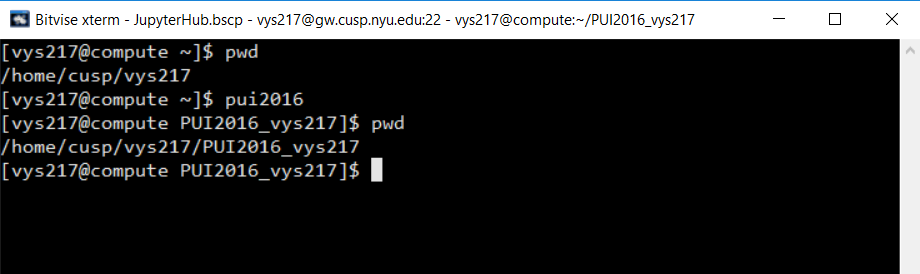

# PUI2016

## This repository contains the Assignment 1,2 and 3 given for the PUI 2016 Homework 1

### Assignment 1 and Assignment 2  

Assignment 1 was completed on my own. I forked Priyanshi's Repo(priyanshi09), Aaron's, Pooneh's Repo for Assignment 1 and contributed to their repos. 
In Assignment 2, Jonathan Pichot helped me with the space issue while declaring the export variable in .bashrc file. 

### Assignment 3

Henry Lin helped me with the legend columns. The rest of the code was done by me with a little help from google for the syntax.

I also helped others in completing their assignments.

### Setting the Enviornment

Step 1 - From windows PC connected to the Data Facility using my netid, password and host as "gw.cusp.nyu.edu"

Step 2 - Opened a new terminal console from the options available in the left side of Bitvise SSH client

Step 3 - Connect to 'compute' using command "ssh -X -A compute"

Step 4 - Created the "PUI2016_vys217" directory, inside the directory changed the .bashrc file to add the enviroment variable and the alias as below

The export statement assings the given path to the variable 'PUI2016' and alias assigns the given command to the variable 'pui2016'. The export and alias statement are written in .bashrc file so that they are preserved for every terminal which we use.

When the alias 'pui2016' is called in the terminal, it executes the command 'cd(change directory) /home/cusp/vys217/PUI2016_vys217/(enviroment variable PUI2016)

Step 5 - Set Up the GitHub repository for 'PUI2016_vys217', set up the remote git repository 'PUI2016_vys217' in 'compute'. 

Step 6 - Add another directory 'HW1_vys217', inside it create the README.md file, add the screenshot images.

Step 7 - Create the link between Github repo 'PUI2016_vys217' and remote repo then add, commit and push our changes. 
